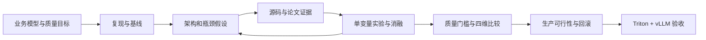

# inference-system-lab

一个长期维护的 **MLM / 多模态大模型推理优化知识库、实验平台、Benchmark 平台与 AI-Native Research Workspace**。这里用 MLM 指多模态大模型，不指 masked language modeling。

目标：成长为能提出问题、定位瓶颈、设计实验并判断生产价值的 Inference Systems / Optimization Research Engineer。以 Qwen 与业务微调模型为主线，以 Llama 为对照，以 Triton + vLLM 为生产参照。

## 从这里开始

1. 阅读 [Roadmap](ROADMAP.md) 与 [弹性学习计划](LEARNING_PLAN.md)。
2. 打开 [当前 Sprint](sprints/001-prefill-decode.md)，先写预测，再运行 CPU 公式示例。
3. 用 [研究笔记](templates/research-note.md) 记录因果链，用 [实验模板](templates/experiment.md) 封存协议。
4. 按 [Benchmark 合同](benchmarks/README.md) 收集真实结果，经质量门槛再比较 Pareto。
5. 每个 Sprint 留下一段自己的解释和下一步最小实验。

```bash
python3 -m unittest discover -s tests -v
python3 scripts/lab.py kv --layers 32 --kv-heads 8 --head-dim 128 --tokens 8192 --batch 4 --bytes 2
python3 scripts/lab.py workload --count 20 --output /tmp/lab-workload.jsonl
python3 scripts/lab.py summarize benchmarks/workloads/synthetic-events.jsonl --duration 4
python3 scripts/lab.py compare benchmarks/workloads/synthetic-runs.json
python3 scripts/check_links.py
```

这些命令只验证公式和分析工具，不加载模型，不执行 GPU benchmark。示例结果均为 synthetic，不能作为性能或生产推荐。Python 3.9+ 标准库即可运行。

## 工作闭环



Scheduler 在每轮执行前选择请求和 token；它不是 Decode 结束后才出现。客户端、服务队列、runtime、GPU 与网络共同决定端到端延迟。

## 导航

| 目录 | 用途 |
|---|---|
| [docs](docs/README.md) | 因果模型、原理与问题驱动源码阅读 |
| [models](models/README.md) | Qwen 演进、Llama 对照与微调差异 |
| [papers](papers/reading-list.md) | 按瓶颈组织的论文及生产迁移判断 |
| [experiments](experiments/README.md) | 封存假设、协议、矩阵、消融 |
| [benchmarks](benchmarks/README.md) | workload、指标、原始证据和分析 |
| [projects](projects/README.md) | 四个可积累的工程项目 |
| [ai](ai/README.md) | AI 研究协作、代码审阅和实验审计 |
| [knowledge](knowledge/README.md) | why、mental models、debugging、教训 |
| [templates](templates/README.md) | 可复制的任务与交付模板 |

## 证据与维护

初始化提供学习内容、计划、模板、CPU 工具和未启用的 CI 模板；尚无 GPU 实测、业务质量验收、生产部署或已验证的 vLLM 补丁。外部依赖、源码路径与支持矩阵必须按实验时的 commit 重新核对。参见 [来源索引](docs/sources.md)。

每次实验保存模型/数据/代码 hash、环境、命令、完整样本与失败记录；结果追加写入，修订保留原因。业务数据、权重、令牌、内部主机和生产原始日志保存在忽略目录或外部存储，只提交脱敏元数据。GitHub 初始化状态见 [发布记录](docs/repository-status.md)。
